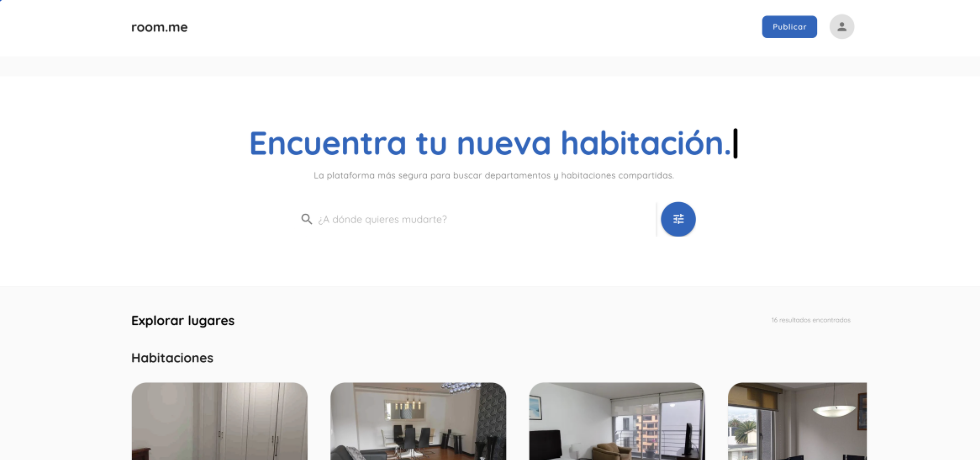
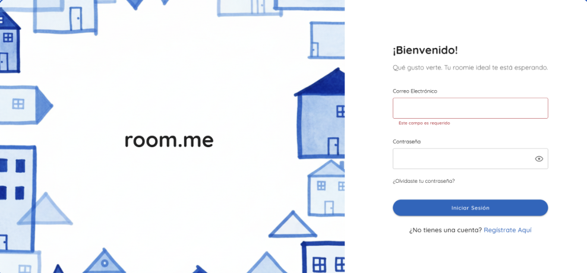
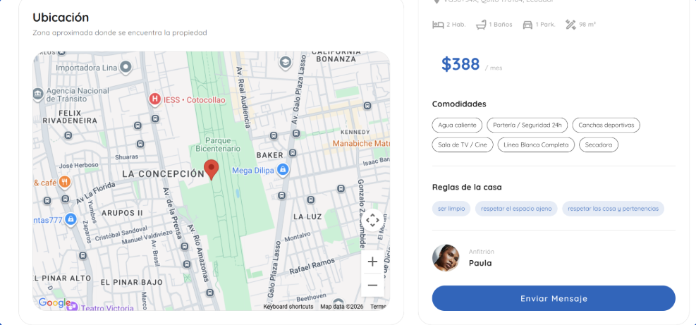
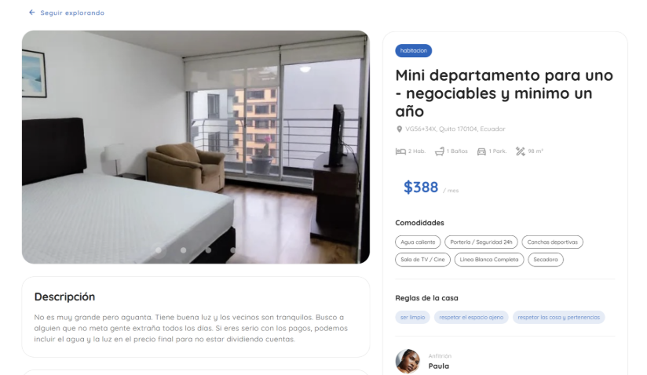

# Room.me - Backend & Web App

**Room.me** es una plataforma diseñada para conectar a personas que buscan compañeros de cuarto de forma segura y eficiente. El enfoque principal del proyecto es la gestión de perfiles, geolocalización y autenticación robusta.

---

## Tecnologías Utilizadas

### Backend
*   **Lenguaje:** C# (.NET Core)
*   **Framework:** ASP.NET Core Web API
*   **Autenticación:** JSON Web Tokens (JWT)
*   **Base de Datos:** SQL Server (Entity Framework Core)
*   **Servicios Externos:** 
    *   SendGrid (Notificaciones por correo)
    *   Google Maps API (Geolocalización y mapas)

### Frontend
*   **Framework:** Vue.js
*   **Estilos:** CSS3 / Framework de componentes

---

## Características Principales

- **Seguridad:** Implementación de autenticación y autorización mediante JWT.
- **Geolocalización:** Integración con la API de Google Maps para visualizar la ubicación de las habitaciones disponibles.
- **Comunicación:** Sistema de envío de correos automáticos mediante SendGrid para confirmaciones de registro.
- **Arquitectura:** Diseño de API REST siguiendo buenas prácticas y separación de responsabilidades.
- **Persistencia:** Modelado de datos relacional optimizado en SQL Server.

---

### Vista previa de la App

Aqui puedes ver cómo se ve la interfaz de usuario:

Pantalla Principal de Room.me

 

Pantalla de Inicio de Room.me

Pantalla de Habitacion Room.me

